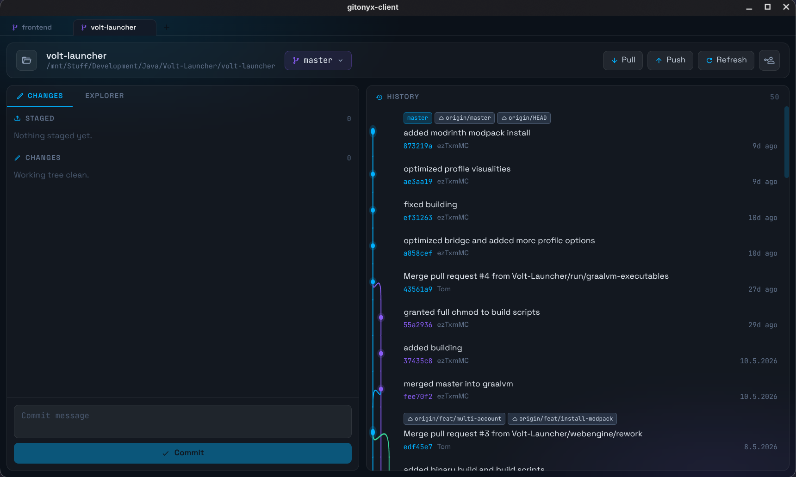

# GitOnyx Client

A lightweight, keyboard-friendly Git GUI built with Electron and React. Dark glassmorphic interface, multi-repository tabs, and a branching graph — no cloud, no telemetry, just git.




---

## Features

### Multi-repository tabs
Open multiple repositories at once and switch between them with a tab bar at the top. Tabs persist across restarts — your project list is saved to `~/.gitonyx/projects.json`.

### Branch graph
The history panel renders a full commit graph with colored branch lanes, S-curve merge lines, and commit nodes — so you can see exactly where branches diverge and converge.

### Staging & committing
- Stage or unstage individual files with a single click
- Stage all changes at once
- Write a commit message and commit — all without leaving the keyboard

### Branch management
- View all local and remote branches in a dropdown
- Check out any branch instantly
- Create a new branch at any commit directly from the history panel
- See how many commits you are ahead/behind the remote at a glance

### File explorer
Browse the repository tree with live git status indicators (modified, added, deleted, renamed) on every file and folder.

### Remote operations
Pull and push with one click. When credentials are needed the app opens a credential dialog — username and password/token are kept in memory only, never written to disk.

---

## Getting started

**Prerequisites:** Node.js 20+, [Bun](https://bun.sh) (or npm), Git installed and on your `PATH`.

```bash
# Install dependencies
bun install        # or: npm install

# Start the app in development mode
bun run dev        # or: npm run dev
```

The Electron window opens automatically. Use the `+` button in the tab bar to open a local Git repository.

### Building for distribution

```bash
bun run build      # or: npm run build
```

Output is placed in `dist-electron/` (main process) and `dist/` (renderer).

---

## Tech stack

| Layer | Technology |
|---|---|
| Shell | [Electron 42](https://www.electronjs.org) |
| UI | [React 19](https://react.dev) + [TypeScript 6](https://www.typescriptlang.org) |
| Styling | [Tailwind CSS v4](https://tailwindcss.com) |
| Icons | [@iconify/react](https://iconify.design) (Material Design Icons) |
| Fonts | Space Grotesk · JetBrains Mono (bundled locally) |
| Bundler | [Vite 8](https://vitejs.dev) + vite-plugin-electron |

Git commands run as child processes via `node:child_process`. The renderer communicates with the main process through a typed context bridge (`window.gitBridge`). Only an explicit allowlist of git subcommands can be executed.

---

## Project structure

```
electron/
  main.ts          — BrowserWindow setup
  git.ts           — IPC handlers, git child-process runner, auth management
  preload.ts       — Context bridge (window.gitBridge)

src/
  App.tsx          — Project tabs, workspace orchestration
  components/
    Header.tsx     — Repo name, branch picker, pull/push/refresh, auth button
    ChangesPanel.tsx  — Staged/unstaged files, commit form
    HistoryPanel.tsx  — Commit graph + branch-creation flow
    ExplorerPanel.tsx — File tree with git status overlays
    Welcome.tsx    — Empty state / open-repository prompt
    AuthDialog.tsx — Git credential input dialog
  git/
    models.ts      — FileChange, Branch, Commit — parse raw git output
    graph.ts       — Lane-assignment algorithm + SVG segment computation
  hooks/
    useGit.ts      — Typed wrappers around window.gitBridge.exec
```

---

## Keyboard shortcuts

| Where | Key | Action |
|---|---|---|
| Commit message | `Ctrl + Enter` | Commit staged changes |
| Branch name input | `Enter` | Confirm branch creation |
| Branch name input | `Escape` | Cancel |
| Branch dropdown | `Escape` / click outside | Close |

---

## Authentication

HTTPS credentials are stored **in memory only** for the lifetime of the app process. They are passed to git via a temporary `GIT_ASKPASS` script and are never written to disk or the system credential store. Click the account icon in the header to set or clear credentials.

For SSH repositories no credential management is needed — the system SSH agent handles authentication automatically.

---

## License

MIT
